# Grocery shop

This web application automates the operation of a grocery store. 
Users can have the following roles: ADMIN, USER, PROJECT_MANAGER, MANAGER, STOREKEEPER.
* ADMIN can do everything.
* USER can view warehouse balances of goods.
* PROJECT_MANAGER can work with projects and assign them to Customer orders.
* MANAGER is responsible for working with clients and working with Customer orders
* STOREKEEPER accepts goods into the warehouse and works with product items.

Receipt of goods to the warehouse is issued by <u>Provider order</u> document.
The sale of goods to a client is carried out using the <u>Customer Order</u> document.
Accounting for goods is carried out taking into account units of measurement and categories.
Goods in the warehouse are stored in the context of basic units of measurement.
You can leave comments about each of the products.
Clients are assigned a contract and a certain status. A manager is assigned to each client.
The application has localization configured for English and Russian.
In the application you can upload images for products and users.

Class diagram

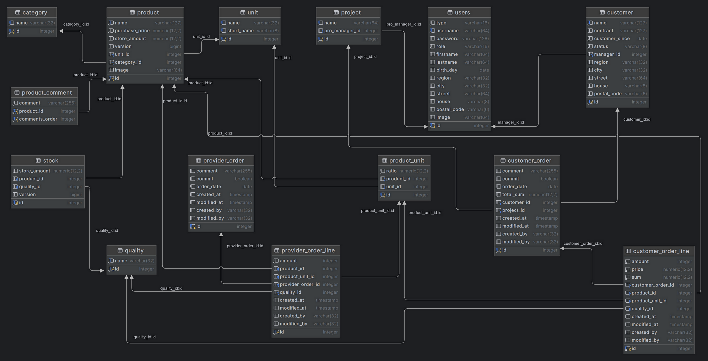

### <u>Run guide:</u>

To build the project: *.\gradlew clean bootJar -x test*\
To execute the app: *docker-compose up -d*\
Type in your browser: http://localhost:8080

#### Admin by default:

* login: a@mail.ru
* password: 123

#### Example file <u>.env</u>:
POSTGRES_HOST=dbase\
POSTGRES_DB=grocery\
POSTGRES_SCHEMA=shop\
POSTGRES_USER=postgres\
POSTGRES_PASSWORD=post

INIT_USERNAME=admin\
INIT_LOGIN=a@mail.ru\
INIT_PASSWORD=123

### <u>Technology stack:</u>

* Java: JDK 17
* Framework: Spring boot 3 (web, validation, data-jpa, security, data-rest)
* Build: Gradle
* ORM: Hibernate
* DB: Postgres
* Web server: Apache Tomcat
* Front: Thymeleaf
* Library: Lombok
* Swagger: Springdoc-openapi
* Migrations: Liquibase
* Containers: Docker, docker-compose
* Tests: JUnit 5, Mockito, Testcontainers
* and probably something else...

Application view

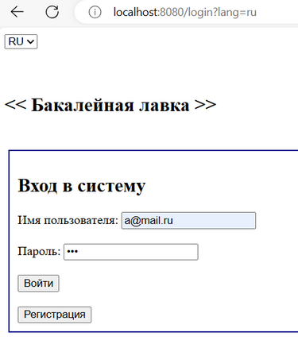

---

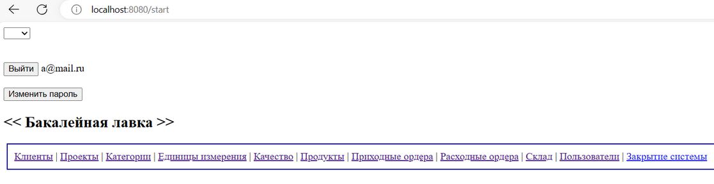

---

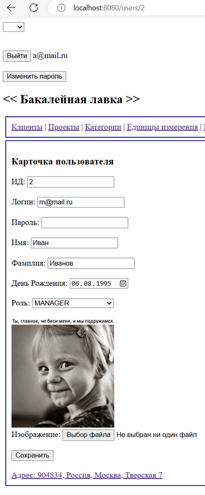

---

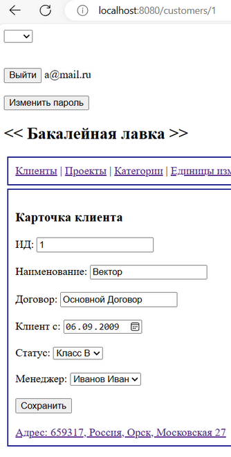

---

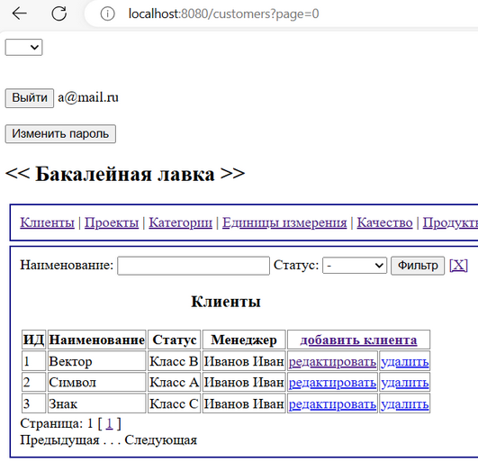

---

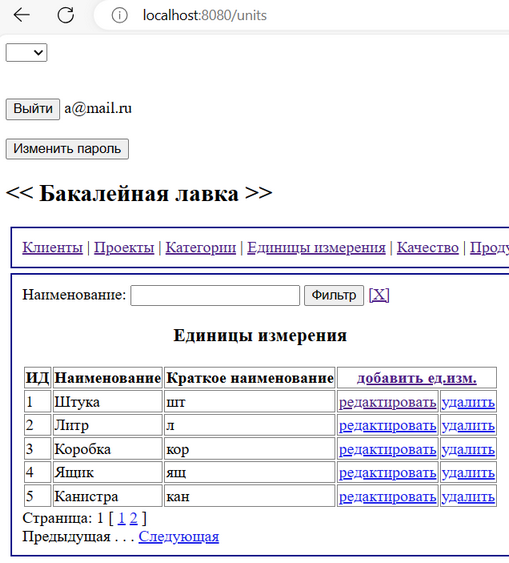

---

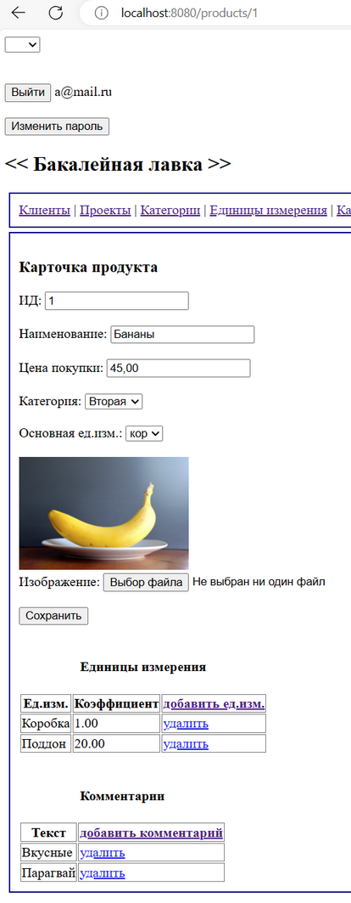

---

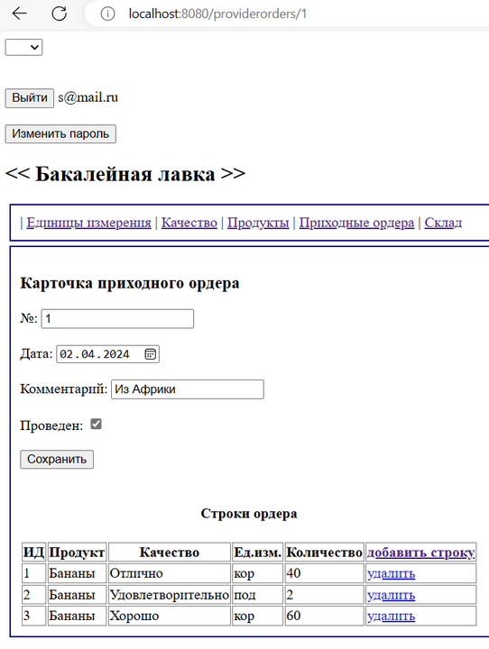

---

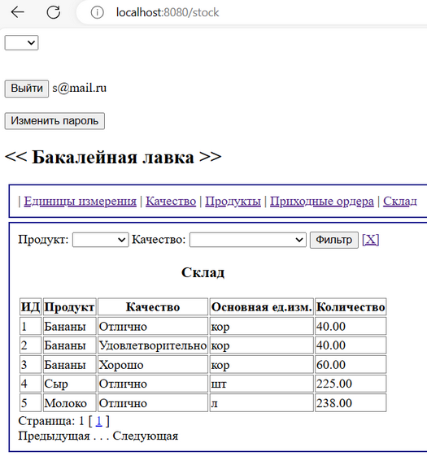

---

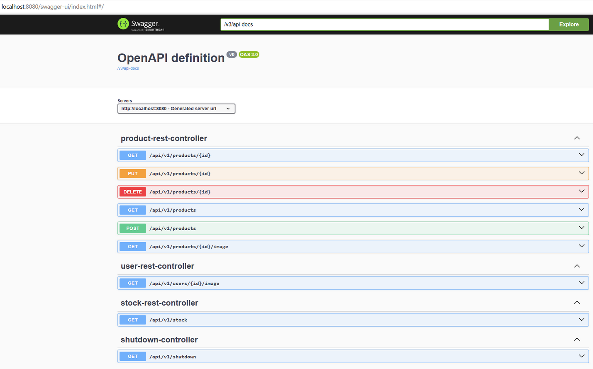

